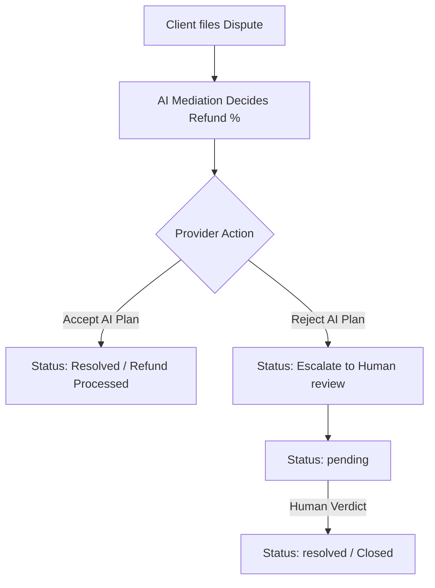

# 🟢 HUNAR — AI-Powered Informal Service Economy Platform

> **Google Antigravity Hackathon 2026**  
> **Developed By:** Ali Jan, Muhammad Noman & Nabil Ahmad  
> **Tech Stack:** React Native (Expo SDK 54) + Node.js (Express) + MongoDB Atlas + Groq Cloud (Llama 3 8B / 70B) + Google Maps (Geospatial Logic)  
> **Built using:** Google Antigravity IDE  

---

## 📖 What is HUNAR?

**HUNAR** is a next-generation platform designed to formalize and automate the informal service economy in Pakistan. It directly connects users with trusted local home service professionals—such as plumbers, electricians, AC technicians, tutors, beauticians, and mechanics—through a seamless, conversational, and highly secure AI-driven workflow.

### The Problem It Solves
In Pakistan, home service workers are found through messy WhatsApp groups, phone trees, or word-of-mouth recommendations. This system yields:
1. 🛑 **Zero pricing transparency** (ad-hoc charging).
2. 🛑 **High matching latency** and no reliable travel buffer scheduling.
3. 🛑 **No accountability or safety guarantees** when work goes wrong.
4. 🛑 **Code-switching language barriers** (most users mix English and Roman Urdu, e.g., *"AC check karwana hai kal G-13 subah"*).

### The HUNAR Solution
HUNAR automates the entire service lifecycle—from discovery and booking to tracking, dynamic itemized invoicing, and dispute mediation—using a **7-Step Agentic AI Orchestrator** working side-by-side with deterministic mathematical engines.

---

## 🛠️ System Architecture

```
                  ┌─────────────────────────────────┐
                  │   React Native (Expo Client)    │
                  └────────────────┬────────────────┘
                                   │
                                   │ HTTPS / JWT Auth
                                   ▼
                  ┌─────────────────────────────────┐
                  │       Express REST API          │
                  └────────────────┬────────────────┘
                                   │
                                   ▼
                  ┌─────────────────────────────────┐
                  │    7-Step Agent Orchestrator    │
                  └────────────────┬────────────────┘
                                   │
      ┌────────────────────────────┼───────────────────────────┐
      ▼ (AI Reasoning)             ▼ (Deterministic Math)      ▼ (Persistence)
┌───────────┐                ┌───────────┐               ┌───────────┐
│ Groq LLM  │                │  Pricing  │               │  MongoDB  │
│ (Llama 3) │                │  Formula  │               │   Atlas   │
└───────────┘                └───────────┘               └───────────┘
```

---

## 🤖 The 7-Step Agentic AI Orchestrator

Every service booking request triggered by the user is routed through a series of specialized AI agents:

### 1️⃣ Intent Parser Agent (`intentParser.js`)
* **Role:** Language Understanding.
* **Logic:** Employs Llama 3 on Groq to parse user inputs written in English, Urdu, or Roman Urdu. It handles typos, slang, and code-switching, extracting the service type, sector, urgency, and budget constraints into a structured JSON payload.
* **Fallback:** If the user fails to provide necessary details (e.g. they forget to mention where the job is), the agent automatically returns a Roman Urdu clarifying question (*"Aap ka sector ya area kya hai?"*) to lock in context.

### 2️⃣ Provider Matcher & Re-ranker Agent (`providerMatcher.js`)
* **Role:** Multi-Factor Supplier Selection.
* **Logic:** First runs a deterministic **7-factor math score** to find the closest, cheapest, and most reliable providers. Then, Groq LLM re-ranks the top 5 candidates.
* **AI Decision:** For a highly complex, urgent plumbing leak, Groq will prioritize a provider with a 99% on-time record over one who is slightly closer but cancelled recently, explaining the reasoning in a structured trace.

### 3️⃣ Travel-Buffer Scheduler Agent (`scheduler.js`)
* **Role:** Smart Slot Reservation.
* **Logic:** Checks the provider's calendar for conflict. It reasons about spatial-temporal travel times (*"If provider has a job ending in F-10 at 4:00 PM, can they comfortably reach G-13 for a 4:30 PM slot?"*).
* **Smart Fallbacks:** If a conflict exists, it automatically offers 3 beautiful alternative slots.

### 4️⃣ Dynamic Pricing Agent (`pricingEngine.js`)
* **Role:** Deterministic Fair Invoicing.
* **Logic:** Runs a strict mathematical formula ensuring exact reproducibility.
  ```
  Total = (Base Hourly Rate + Distance Fee + Urgency Premium - Loyalty Discount)
          × Complexity Multiplier × Sector Surge Multiplier
  ```
* **Explanation:** Proves to the customer exactly why they are paying Rs. X, showing travel charges and surge factors transparently.

### 5️⃣ Booking Simulator (`bookingSimulator.js`)
* **Role:** State Commit.
* **Logic:** Commits the booking to MongoDB and dispatches a simulated SMS notification (*"Aapka booking BK-2026 confirm ho chuka hai!"*).

### 6️⃣ Reputation & Quality Loop (`qualityLoop.js`)
* **Role:** Self-Correcting Ledger.
* **Logic:** Feeds user feedback (star ratings and review text) back into the provider's scoring matrices to adjust their future matchmaking weights.

### 7️⃣ Dispute Resolution Agent (`disputeResolver.js`)
* **Role:** AI Mediation & Escrow.
* **Logic:** Parses customer disputes (e.g. overcharging, poor quality). It matches the booking invoice with the complaint and decides a fair resolution (refund percentage, warnings, or blacklist).

---

## ⚖️ Provider-Client Dispute Escrow Loop (Multi-Role Workflow)

Introduced as a highly interactive feedback system, the dispute escrow workflow enables full mediation accountability:



1. **Provider Disputes Ledger:** Logged-in providers see active disputes raised against them with AI's recommended refund and reasoning.
2. **tactile Responses:** Providers can either **Accept** (which processes the refund and resolves the dispute) or **Reject** the AI decision.
3. **Human Review Escalate:** Rejection escalates the case to human review. The case enters a `pending` manual audit state.
4. **👨‍💼 Demo Admin Override:** Includes a quick admin resolve button so you can instantly simulate human managers stepping in to award refunds and notify both parties!

---

## 📡 APIs & Third-Party Integrations

| API | Type | Usage |
|---|---|---|
| **Groq Cloud (Llama 3)** | Real | Runs the parser, matching re-ranker, scheduler travel buffer, and dispute mediator. |
| **MongoDB Atlas** | Real | Cloud database storing Users, Providers, Bookings, ReasoningLogs, and Notifications. |
| **Google Maps API** | Real | Decodes sector inputs into coordinate pairs to measure exact provider-to-client distance. |


---

## 🚀 Getting Started

### 📂 Repository Structure
```
Hunar/
├── backend/    # Node.js + Express REST API & AI Orchestrator
├── mobile/     # React Native (Expo) Mobile Frontend
└── README.md   # This Master Guide
```

### 1. Running the Backend
1. Go to backend: `cd backend`
2. Configure `.env` with: `MONGO_URI`, `GROQ_API_KEY`, `JWT_SECRET`, `PORT=5000`
3. Run seeds to populate Islamabad providers: `npm run seed`
4. Start development server: `npm run dev`

### 2. Running the Mobile App
1. Go to mobile: `cd mobile`
2. Install dependencies: `npm install --legacy-peer-deps`
3. Update `src/services/api.js` with your backend server's active network IP.
4. Start Expo Metro bundler: `npx expo start`
5. Scan QR code using **Expo Go** on your iOS or Android device!

---

*🏆 Built for the Google Antigravity Hackathon | HUNAR - Empowering informal skills through AI.*
