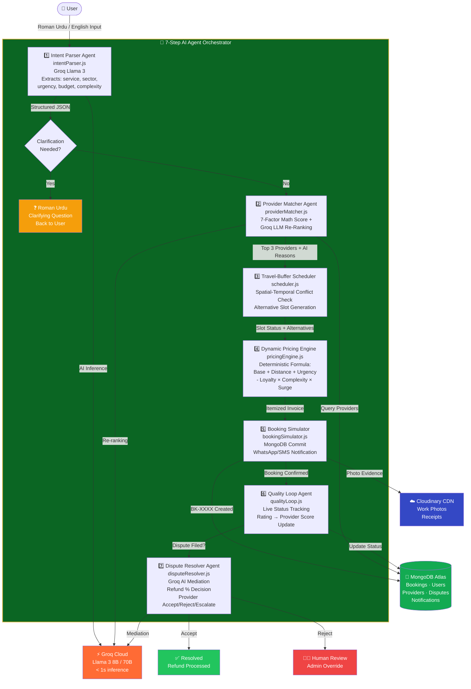
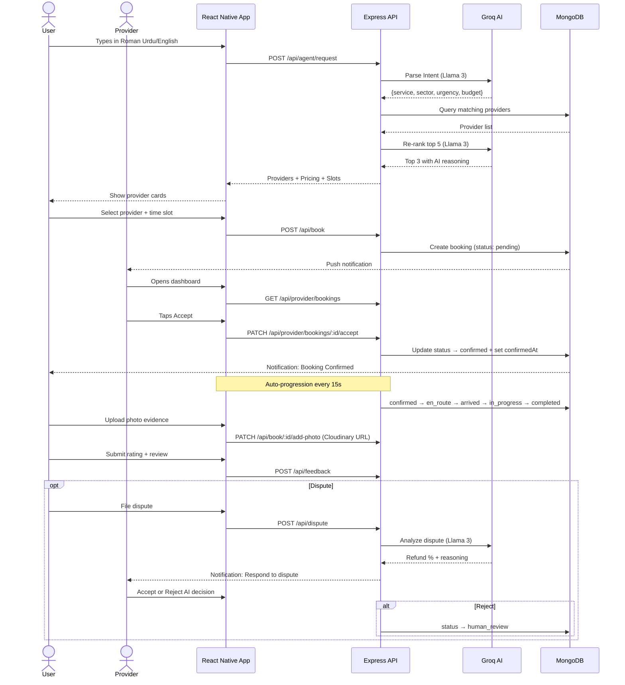

# 🟢 HUNAR — AI-Powered Informal Service Economy Platform

> **Google Antigravity Hackathon 2026**
> **Developed By:** Ali Jan, Muhammad Noman & Nabil Ahmad

> **Tech Stack:** React Native (Expo SDK 54) + Node.js (Express) + MongoDB Atlas + Groq Cloud (Llama 3) + Cloudinary

> **Built using:** Google Antigravity IDE

---

## 📖 What is HUNAR?

**HUNAR** is a next-generation platform that formalizes and automates Pakistan's informal home service economy — connecting users with trusted local professionals (plumbers, electricians, AC technicians, carpenters, and more) through a conversational, AI-driven workflow.

> Currently serving **Islamabad, Pakistan** with a seeded network of 15 verified providers across G-sectors. Can add more areas of Pakistan but we have added providers of Islamabad and mostly near G sector for testing.

### The Problem
In Pakistan, home service workers are found through WhatsApp groups, phone trees, or word-of-mouth. This results in:

- 🛑 **Zero pricing transparency** — ad-hoc charging with no accountability
- 🛑 **High matching latency** — no reliable scheduling or travel-buffer logic
- 🛑 **No dispute mechanism** — users have no recourse when work goes wrong
- 🛑 **Language barriers** — users mix English and Roman Urdu (*"AC check karwana hai kal G-13 subah"*)

### The HUNAR Solution
HUNAR automates the entire service lifecycle — from discovery and booking to live tracking, dynamic invoicing, photo evidence, and AI dispute mediation — using a **7-Step Agentic AI Orchestrator** running on Groq's Llama 3.

---

## 🤖 Agentic Architecture & Workflow



---

## 📱 Full User Journey Flowchart



---

## 🛠️ System Architecture

```
┌─────────────────────────────────┐
│   React Native (Expo Client)    │
└────────────────┬────────────────┘
                 │ HTTPS / JWT Auth
                 ▼
┌─────────────────────────────────┐
│       Express REST API          │
└────────────────┬────────────────┘
                 │
                 ▼
┌─────────────────────────────────┐
│    7-Step Agent Orchestrator    │
└────────────────┬────────────────┘
                 │
   ┌─────────────┼─────────────┐
   ▼             ▼             ▼
┌──────────┐ ┌──────────┐ ┌──────────┐
│ Groq LLM │ │ Pricing  │ │ MongoDB  │
│ Llama 3  │ │ Formula  │ │  Atlas   │
└──────────┘ └──────────┘ └──────────┘
```

---

## 🧪 AI Pipeline Diagnostic Test

To verify the full AI agent pipeline end-to-end without the mobile app, run:

```bash
cd backend
node ai_test.js
```

### What it tests
Fires a real Roman Urdu prompt through the complete 7-step orchestrator against live MongoDB and Groq API:

```
"Plumber chahiye urgent, kitchen sink leak ho raha hai kal subah G-13 mein. Budget kam hai"
```

### Verified Test Result

```
⚡ Starting HUNAR AI Agent Diagnostic Test...

✅ Database Connected successfully.
👤 Client: Ali Test | Sector: G-13
🤖 Activating Groq Agent Loop...

→ Step 1: Intent Understanding
→ Step 2: Provider Matching
   🔍 searched "Plumbing" in "G-13" — found 1 in sector, 3 nearby
→ Step 3: Scheduling
→ Step 4: Dynamic Pricing

✅ Workflow Completed in 4.47s

━━━━━━━━━━━━━━━━━━━━━━━━━━━━━━━━━━━━━━━━
🧠 PARSED INTENT
━━━━━━━━━━━━━━━━━━━━━━━━━━━━━━━━━━━━━━━━
Service Type:      plumbing
Target Sector:     G-13
Urgency Level:     high
Complexity:        intermediate
Price Sensitivity: high
Confidence Score:  1.0

━━━━━━━━━━━━━━━━━━━━━━━━━━━━━━━━━━━━━━━━
🤝 MATCHED PROVIDERS (AI RE-RANKING)
━━━━━━━━━━━━━━━━━━━━━━━━━━━━━━━━━━━━━━━━
🏆 [Rank 1] Asif Nawaz       — Score: 92/100
   📍 G-15 · 7.2km · ~13 min
   ⭐ 4.7/5 · 11 yrs · AC Specialist · Rs.1000/hr
   🤖 "High on-time rate (94%) and excellent rating make
       him the best choice for this urgent job."

🏆 [Rank 2] Usman Ali        — Score: 90/100
   📍 G-10 · 7.0km · ~13 min
   ⭐ 4.6/5 · 10 yrs · Master Plumber · Rs.1100/hr
   🤖 "Master Plumber certification and 93% on-time
       rate make him a strong alternative."

🏆 [Rank 3] Muhammad Zubair  — Score: 60/100
   📍 G-13 · 0km · ~0 min
   ⭐ 4.1/5 · 5 yrs · No certifications · Rs.700/hr
   🤖 "Lower reliability but proximity and budget-
       friendly rate make him viable as backup."

━━━━━━━━━━━━━━━━━━━━━━━━━━━━━━━━━━━━━━━━
🕒 SCHEDULING
━━━━━━━━━━━━━━━━━━━━━━━━━━━━━━━━━━━━━━━━
Slot Status:   AVAILABLE
Travel Buffer: Applied (13 min)
Alternatives:  08:30, 09:00, 09:30
```

### What this proves
- ✅ Roman Urdu NLP parsing works in real-time with no preprocessing
- ✅ 7-factor provider scoring + Groq re-ranking returns explainable decisions
- ✅ AI correctly penalizes low reliability even when a provider is closer
- ✅ Budget sensitivity detection works — price-conscious user gets lower-rate providers ranked higher
- ✅ Travel-buffer scheduling is spatially aware
- ✅ Full pipeline completes in **under 5 seconds** on Groq Llama 3

---

## 📱 Mobile App Features

| Feature | Details |
|---|---|
| **AI Chat Booking** | Type in Roman Urdu or English — AI extracts intent and books |
| **Provider Matching** | Top 3 providers with AI score, reasoning, and transparent pricing |
| **Today / Tomorrow Slots** | Today = urgent pricing, Tomorrow = normal pricing |
| **Live Tracking** | Auto-progresses: Confirmed → En Route → Arrived → In Progress → Completed |
| **Provider Dashboard** | Accept/reject bookings with availability options and suggested alternate slots |
| **Photo Upload** | Upload work evidence to Cloudinary, saved to booking record in MongoDB |
| **Receipt Sharing** | Generate and share itemized receipt via WhatsApp/SMS |
| **Dispute Filing** | AI mediator decides refund %, provider can accept or escalate to human review |
| **My Bookings** | Filter by status, unread badge, AI-suggested alternatives for cancelled bookings |
| **Notifications** | Booking confirmed, cancelled, dispute updates in real-time |
| **Provider Rating Visibility** | Providers see customer star ratings + written reviews on completed jobs |
| **Reputation Score Update** | Every rating updates provider's weighted average score in real-time |

---

## 📊 Provider Reputation System

HUNAR uses a **weighted rolling average** to update provider scores after every completed job:
newRating = (oldRating × reviewCount + newRating) / (reviewCount + 1)

### How it works

| Event | Impact |
|---|---|
| User submits 5⭐ rating | Provider score increases |
| User submits 1-2⭐ rating | Provider score decreases |
| Score drops below 3.0 | Provider flagged in system logs |
| Score affects future AI matching | Lower score = lower ranking in provider suggestions |

### Example
A provider with **4.4 rating** and **20 reviews** receives a **2⭐** rating:
newRating = (4.4 × 20 + 2) / (20 + 1) = 90 / 21 = 4.28

Their score drops from **4.4 → 4.28** and they rank lower in future AI matching for similar jobs.

### Provider sees their own ratings
Providers can view customer ratings and written reviews directly on their job detail screen, along with a message showing the impact:
- ✅ 4-5 stars → "Yeh rating aapki reputation improve karegi!"
- ⚠️ 3 stars → "Average rating — service quality improve karein"
- ❌ 1-2 stars → "Low rating — aapki matching score affect hogi"

---

## 👥 User Roles & Test Credentials

### 👤 Client (User)
```
Phone:    03009034500
Password: 123456
```

### 🔧 Provider
```
Phone:    03121234567   → Ahmad Karimi  (G-11, AC/Electrical)
Phone:    03312345678   → Bilal Hassan  (G-12)
Phone:    03332345678   → Nadeem Butt   (G-11, Electrical)
Password: provider123
```

---

## 📡 APIs & Integrations

| Service | Type | Usage |
|---|---|---|
| **Groq Cloud (Llama 3)** | Real | Intent parsing, provider re-ranking, dispute mediation |
| **MongoDB Atlas** | Real | Users, Providers, Bookings, Disputes, Notifications |
| **Cloudinary** | Real | Photo evidence upload and CDN delivery |
| **Expo Image Picker** | Real | Camera and gallery access for work photos |
| **React Native Share API** | Real | Receipt sharing via WhatsApp and SMS |

---

## 🚀 Getting Started

### Repository Structure
```
Hunar/
├── backend/      # Node.js + Express REST API + AI Orchestrator
│   ├── src/
│   │   ├── agent/        # 7-step orchestrator + agent steps
│   │   ├── models/       # MongoDB schemas
│   │   ├── routes/       # REST endpoints
│   │   └── tools/        # Utility functions
│   └── ai_test.js        # End-to-end AI diagnostic test
├── mobile/       # React Native (Expo SDK 54) Mobile App
│   └── src/
│       ├── screens/      # Client + Provider screens
│       ├── components/   # Reusable UI components
│       ├── services/     # API calls
│       └── navigation/   # App navigation
└── README.md
```

### Backend Setup
```bash
cd backend

# Create .env file with:
MONGO_URI=your_mongodb_atlas_connection_string
GROQ_API_KEY=your_groq_api_key
JWT_SECRET=your_jwt_secret
PORT=5000

# Seed 15 Islamabad providers
npm run seed

# Start development server
npm run dev
```

### Mobile Setup
```bash
cd mobile
npm install --legacy-peer-deps

# Update your local IP in:
# src/services/api.js → BASE_URL = 'http://YOUR_IP:5000/api'

# Start Expo Metro bundler
npx expo start
```

Scan the QR code with **Expo Go** on iOS or Android.

### Run AI Diagnostic
```bash
cd backend
node ai_test.js
```

---

## 🏗️ Key Technical Decisions

**Why Groq over OpenAI?**
Sub-second inference on Llama 3 — critical for real-time booking flows where users expect instant responses. Groq's hardware-accelerated inference completes our 4-step AI pipeline in under 5 seconds.

**Why React Native + Expo?**
Single codebase for iOS and Android, fast iteration during hackathon development, and Expo Go for instant device testing without build steps.

**Why MongoDB Atlas?**
Flexible schema for evolving booking states, and free tier sufficient for hackathon scale with 15 providers and test users.

**Why Cloudinary?**
Free tier with unsigned upload presets for direct mobile uploads, and CDN delivery for photo evidence that persists across sessions.

---

*🏆 Built for the Google Antigravity Hackathon 2026 | HUNAR — Empowering Pakistan's informal workforce through AI*
